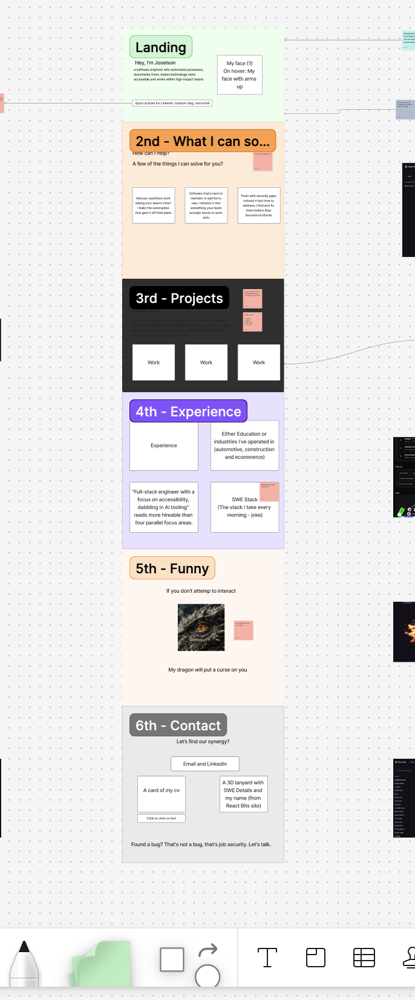

## Joselson Dias digital portfolio

## Figma

This portfolio has been designed on figma and planned on a knanban board before writing a single line of code.



## Run the project

### Option 1: Use your debugger (recommended)

You can run this app without typing terminal commands.

1. Open the project in your IDE (for example, VS Code).
2. Go to **Run and Debug**.
3. Start the Next.js/dev profile (or `npm run dev` profile if your IDE shows npm scripts).
4. Open `http://localhost:3000` in your browser.

This is the easiest path if you prefer point-and-click workflows.

### Option 2: Use terminal commands

1. Install dependencies:

```bash
npm install
```

2. Start the development server:

```bash
npm run dev
```

3. Open `http://localhost:3000` in your browser.

## Build for production

```bash
npm run build
npm start
```
